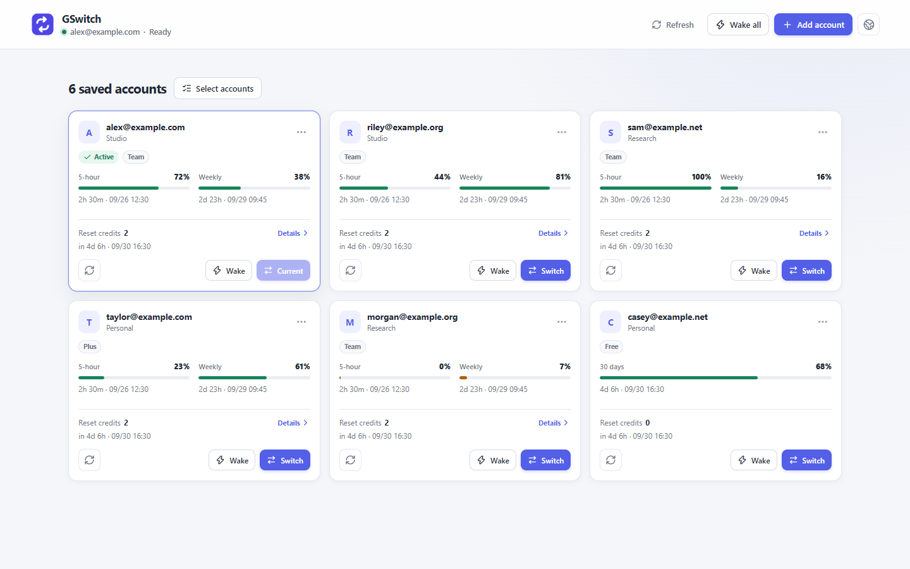

# GSwitch

[简体中文](./README.zh-CN.md) · English

Manage several Codex accounts on one computer: see how much quota each one has
left, switch with one click, and keep using Codex.



- **Every account's quota at a glance.** Five-hour and weekly quota, reset
  times, and available reset credits for each account.
- **Switching you can trust.** Quit Codex and click Switch. GSwitch checks the
  new account after writing it and puts your previous sign-in back if that
  check fails.
- **Bring your accounts from Cockpit Tools.** Scan the
  [Cockpit Tools](https://github.com/jlcodes99/cockpit-tools) accounts on this
  computer, or import its export files, and pick the ones you want.
- **Sign in again in place.** When a saved sign-in stops working, sign in again
  from its card instead of removing and re-adding the account.
- **Wake.** Send one short Codex request to each selected account and see which
  accounts replied.
- **No analytics or telemetry.** Saved credentials stay encrypted on your
  computer.

## Install

Download the [latest release](https://github.com/ginbing/GSwitch/releases/latest):

- **Windows:** `GSwitch_<version>_x64-setup.exe`. The installer is not
  code-signed, so SmartScreen may warn before it runs. GSwitch needs the
  WebView2 runtime, which comes with Windows 11 and up-to-date Windows 10. If
  the installer stalls while downloading WebView2, install it from
  [Microsoft](https://developer.microsoft.com/microsoft-edge/webview2/) and run
  the installer again.
- **macOS:** `aarch64.dmg` for Apple silicon, `x64.dmg` for Intel. The app is
  not notarized by Apple; allow it once in System Settings → Privacy & Security.
- **Linux:** the AppImage or the `.deb` package.

GSwitch checks for updates on its own.

To uninstall, remove GSwitch in Settings → Apps → Installed apps on Windows,
move it to the Trash on macOS, or delete the AppImage or remove the `.deb`
package on Linux.

## Add accounts

- **Sign in:** use Codex's official browser sign-in.
- **Find on this computer:** after you click Scan, GSwitch reads the account
  Codex is signed in with and the local Cockpit Tools accounts
  (`~/.antigravity_cockpit` by default; choose another folder if Cockpit Tools
  keeps them elsewhere). You see a preview and import only the accounts you
  select. Accounts already in GSwitch are never replaced.
- **Choose files:** Cockpit Tools export files, Codex `auth.json`, and Sub2API
  or CPA exports. You can select several at once.

GSwitch never changes Cockpit Tools' files and imports only the credentials
needed to sign in. Passwords, 2FA secrets, notes, and tags stay in Cockpit
Tools.

## Before you switch

- Install Codex.
- Quit Codex, including the desktop app, the CLI, and editor extensions.
  GSwitch tells you when Codex is still running; it never closes Codex for you.
- Codex must keep its sign-in in a file. If it does not, GSwitch asks you to
  turn that on.

## Data and network

- Saved credentials are encrypted on your computer. The key is held by your
  system's credential manager.
- GSwitch connects only to OpenAI, for quota and account actions, and to
  GitHub, to check for GSwitch updates and new Codex CLI versions.

## Build from source

Install the [Tauri prerequisites](https://tauri.app/start/prerequisites/) for
your platform, then:

```bash
git clone https://github.com/ginbing/GSwitch.git
cd GSwitch
pnpm install
pnpm tauri dev
```

Development documentation starts at [docs/README.md](./docs/README.md).

## License

[AGPL-3.0](./LICENSE)
