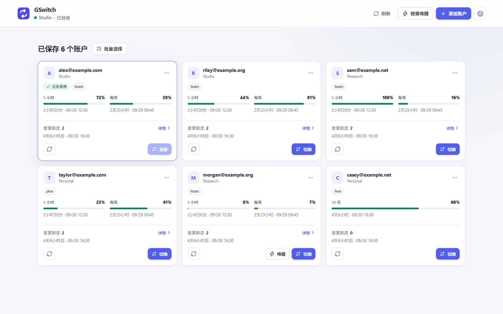

# GSwitch

简体中文 · [English](./README.md)

简洁可靠的 Codex 账户切换工具。

GSwitch 适合使用多个 Codex 账户、希望在一处查看和切换账户的人。打开后即可看到当前账户、额度与可用操作。



图片使用 `example.com`、`example.org` 和 `example.net` 的虚拟邮箱及固定演示额度，不包含用户账户。

## 功能

- 在本机保存多个 Codex 账户
- 将选中的账户导入或导出为一个便携文件
- 查看当前账户
- 查看额度、重置时间与可用的重置额度
- 安全切换账户
- 经确认后使用最早到期的合适重置额度
- 按需对单个或多个账户发送唤醒请求，并查看各账户是否发送及确认结果

## 安装

正式版本发布在 [GitHub Releases](https://github.com/ginbing/GSwitch/releases)。按设备下载：

- **Windows：** NSIS `setup.exe` 安装包
- **macOS：** 对应 Apple Silicon 或 Intel 的 DMG
- **Linux：** AppImage 或 Debian (`.deb`) 安装包

macOS 版本采用临时签名，没有 Apple 公证；系统可能要求在“隐私与安全性”中手动允许打开。

使用 GSwitch 的账户操作前，需要先安装 Codex。Windows 安装包的信任状态、签名职责及发布顺序见[代码签名政策](./docs/code-signing-policy.md)。

### Windows PowerShell 辅助安装

通常直接下载安装包即可。如需使用 PowerShell，可下载 [install.ps1](./install.ps1)，在普通的非管理员 PowerShell 窗口中运行：

```powershell
.\install.ps1
```

脚本下载并启动最新公开版本的同一个 `setup.exe`，不会构建 GSwitch 或安装开发工具。

## 卸载

- **Windows：** 打开“设置 → 应用 → 已安装的应用”，找到 GSwitch 并卸载。
- **macOS：** 将 GSwitch 移到废纸篓。
- **Linux：** 删除 AppImage，或用发行版包管理器卸载 Debian 包。

## 更新

安装后，GSwitch 会检查 GitHub Releases 上经过签名的应用更新，并可在支持的平台从应用内安装。

GSwitch 不收集分析数据，也不发送遥测。它会为你主动执行的账户操作连接 Codex/OpenAI，并通过 GitHub Releases 检查和下载经过签名的应用更新。主窗口显示后，它还会检查 OpenAI 的稳定版 Codex CLI 发布信息；只有确认有新版本时才显示更新入口。CLI 更新必须由你点击启动，Codex 桌面应用则单独更新。

## 从源码构建

先安装对应平台的 Tauri 前置依赖，然后运行：

```bash
git clone https://github.com/ginbing/GSwitch.git
cd GSwitch
pnpm install
pnpm tauri dev
```

开发说明见 [docs/README.md](./docs/README.md)。

GSwitch 是独立项目，与 OpenAI 没有关联。

## 许可证

AGPL-3.0。
